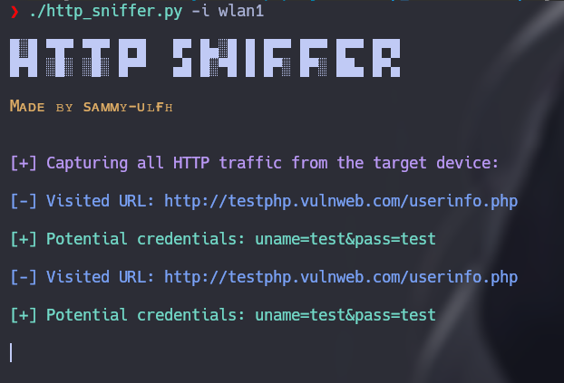
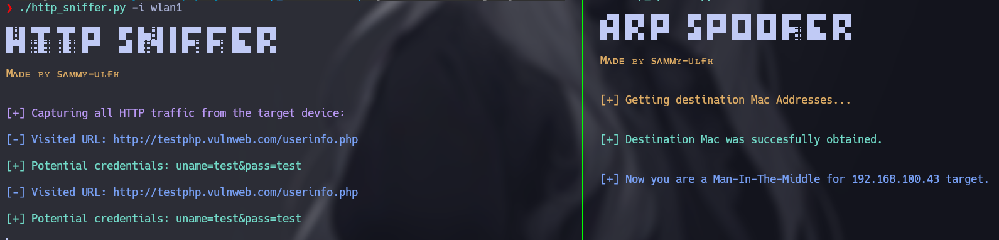

# http_sniffer

<p align="center">
    
</p>

**HTT Sniffer** is a tool that captures **HTTP** traffic on a Network Ineterface. You can use it by providing the **network interface name**.

<p align="center">
    
</p>

## Table of contents

- [First stepts](#what-do-i-need-to-run-it)
- [Neccesarry steps before running](#how-does-it-work)
- [How to run it](#how-do-i-use-it)

## What do I need to run it?

1. First, clone the repository:

    ```git
    git clone https://github.com/sammy-ulfh/http_sniffer.git
    ```

2. Then, navigate to the **http_sniffer/script** directory.

3. Next, install required libraries using pip:

    ```pip3
    pip3 install -r requirements.txt
    ```

## How does it work?

This **HTTP Sniffer** tool that captures all HTTP traffic on your Network Inetrface, focused on capture all visied URL's and potential credentials.

It was built to capture traffic while performing spoofing, allowing you to see all the url's your target is accessing. You can complement the **[arp_spoofing](https://github.com/sammy-ulfh/arp_spoofer)** tool with this one to capure all HTTP traffic from your target.

<p align="center">
    
</p>

## How do I use it?

**NOTE:** Root privileges are required.

- **Inetrface:**
    Provide a Nework Interface Name using the **-i / --interface** argument.<br/>
    Example: -i wlan1

